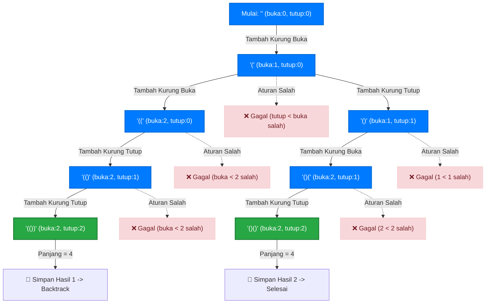
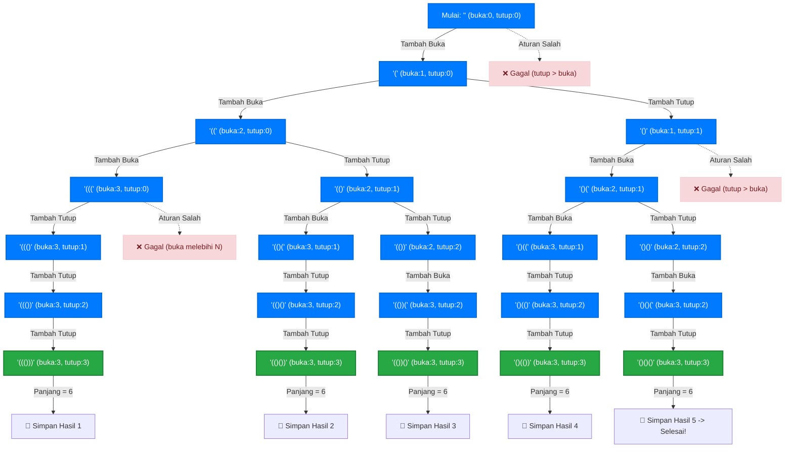

# Penjelasan Study Case

## Untuk N = 2 atau 2 Pasang Bracket

```mermaid
graph TD
    %% Deklarasi Node dan Teksnya
    A["Mulai: '' (buka:0, tutup:0)"]
    B["'(' (buka:1, tutup:0)"]
    C["'((' (buka:2, tutup:0)"]
    D["'(()' (buka:2, tutup:1)"]
    E["'(())' (buka:2, tutup:2)"]
    F["'()' (buka:1, tutup:1)"]
    G["'()(' (buka:2, tutup:1)"]
    H["'()()' (buka:2, tutup:2)"]

    BR1["❌ Gagal (tutup < buka salah)"]
    CR1["❌ Gagal (buka < 2 salah)"]
    DR1["❌ Gagal (buka < 2 salah)"]
    FR1["❌ Gagal (1 < 1 salah)"]
    GR1["❌ Gagal (2 < 2 salah)"]

    Return1["💾 Simpan Hasil 1 -> Backtrack"]
    Return2["💾 Simpan Hasil 2 -> Selesai"]

    %% Hubungan antar Node (Alur Rekursi)
    A -->|Tambah Kurung Buka| B

    %% Cabang Kiri dari '('
    B -->|Tambah Kurung Buka| C
    B -.->|Aturan Salah| BR1

    C -->|Tambah Kurung Tutup| D
    C -.->|Aturan Salah| CR1

    D -->|Tambah Kurung Tutup| E
    D -.->|Aturan Salah| DR1

    E -->|Panjang = 4| Return1

    %% Cabang Kanan dari '('
    B -->|Tambah Kurung Tutup| F

    %% Cabang dari '()'
    F -->|Tambah Kurung Buka| G
    F -.->|Aturan Salah| FR1

    G -->|Tambah Kurung Tutup| H
    G -.->|Aturan Salah| GR1

    H -->|Panjang = 4| Return2

    %% Pewarnaan / Styling Node
    classDef proses fill:#007bff,stroke:#0069d9,stroke-width:2px,color:#fff;
    classDef gol fill:#28a745,stroke:#1e7e34,stroke-width:2px,color:#fff;
    classDef gagal fill:#f8d7da,stroke:#f5c6cb,stroke-width:1px,color:#721c24;

    class A,B,C,D,F,G proses;
    class E,H gol;
    class BR1,CR1,DR1,FR1,GR1 gagal;

```

## Untuk N = 3

```mermaid
graph TD
    A["Mulai: '' (buka:0, tutup:0)"]

    %% Level 1
    B["'(' (buka:1, tutup:0)"]
    A -->|Tambah Buka| B
    A -.->|Aturan Salah| Fail1["❌ Gagal (tutup > buka)"]

    %% Level 2
    C["'((' (buka:2, tutup:0)"]
    O["'()' (buka:1, tutup:1)"]
    B -->|Tambah Buka| C
    B -->|Tambah Tutup| O

    %% Level 3 (Cabang Kiri C)
    D["'(((' (buka:3, tutup:0)"]
    H["'(()' (buka:2, tutup:1)"]
    C -->|Tambah Buka| D
    C -->|Tambah Tutup| H

    %% Level 4 (Cabang D - Mentok Buka)
    E["'((()' (buka:3, tutup:1)"]
    D -->|Tambah Tutup| E
    D -.->|Aturan Salah| Fail2["❌ Gagal (buka melebihi N)"]

    %% Level 5 & 6 (Dari E)
    F["'((())' (buka:3, tutup:2)"]
    E -->|Tambah Tutup| F
    G["'((()))' (buka:3, tutup:3)"]
    F -->|Tambah Tutup| G
    G -->|Panjang = 6| Ret1["💾 Simpan Hasil 1"]

    %% Cabang H
    I["'(()(' (buka:3, tutup:1)"]
    L["'(())' (buka:2, tutup:2)"]
    H -->|Tambah Buka| I
    H -->|Tambah Tutup| L

    J["'(()()' (buka:3, tutup:2)"]
    I -->|Tambah Tutup| J
    K["'(()())' (buka:3, tutup:3)"]
    J -->|Tambah Tutup| K
    K -->|Panjang = 6| Ret2["💾 Simpan Hasil 2"]

    M["'(())(' (buka:3, tutup:2)"]
    L -->|Tambah Buka| M
    N["'(())()' (buka:3, tutup:3)"]
    M -->|Tambah Tutup| N
    N -->|Panjang = 6| Ret3["💾 Simpan Hasil 3"]

    %% Cabang Kanan O
    P["'()(' (buka:2, tutup:1)"]
    O -->|Tambah Buka| P
    O -.->|Aturan Salah| Fail3["❌ Gagal (tutup > buka)"]

    %% Lanjutan P
    Q["'()((' (buka:3, tutup:1)"]
    T["'()()' (buka:2, tutup:2)"]
    P -->|Tambah Buka| Q
    P -->|Tambah Tutup| T

    R["'()(()' (buka:3, tutup:2)"]
    Q -->|Tambah Tutup| R
    S["'()(())' (buka:3, tutup:3)"]
    R -->|Tambah Tutup| S
    S -->|Panjang = 6| Ret4["💾 Simpan Hasil 4"]

    U["'()()(' (buka:3, tutup:2)"]
    T -->|Tambah Buka| U
    V["'()()()' (buka:3, tutup:3)"]
    U -->|Tambah Tutup| V
    V -->|Panjang = 6| Ret5["💾 Simpan Hasil 5 -> Selesai!"]

    %% Styling Node
    classDef proses fill:#007bff,stroke:#0069d9,stroke-width:2px,color:#fff;
    classDef gol fill:#28a745,stroke:#1e7e34,stroke-width:2px,color:#fff;
    classDef gagal fill:#f8d7da,stroke:#f5c6cb,stroke-width:1px,color:#721c24;

    class A,B,C,D,E,F,H,I,J,L,M,O,P,Q,R,T,U proses;
    class G,K,N,S,V gol;
    class Fail1,Fail2,Fail3 gagal;
```
